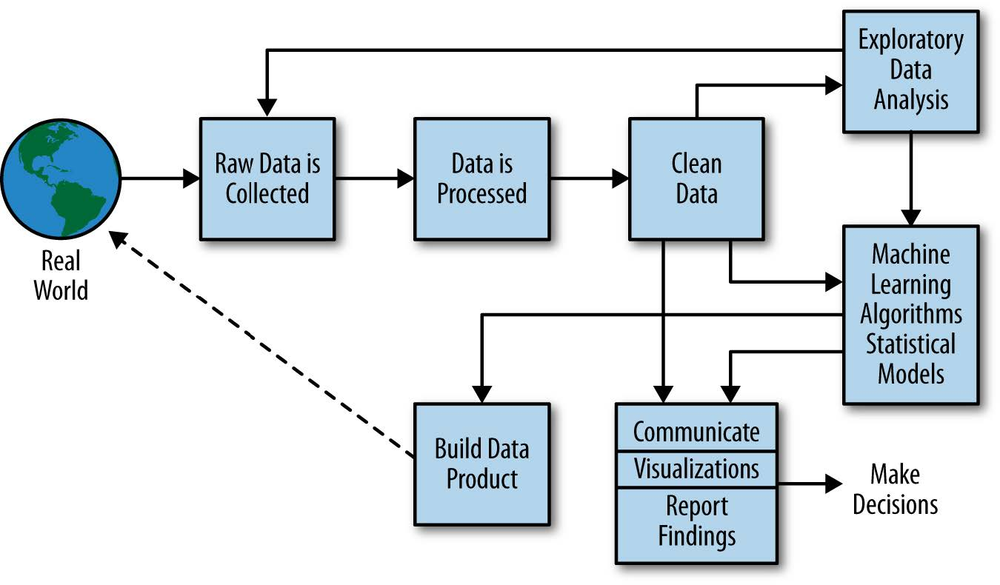

```{r setup, include=FALSE}

options(htmltools.dir.version = FALSE)

knitr::opts_chunk$set(
  echo = FALSE,
  fig.width = 12,
  fig.height = 6,
  dpi = 72 * 5,
  cache = FALSE
)

library(diagram)
library(tidyverse)
library(gam)
library(gridExtra)
library(knitr)
library(kableExtra)
library(scales)
library(widgetframe)
library(magrittr)
library(glmnet)
library(MASS)
library(glue)
library(DT)

```

# Hello! My name is Byron 

.left-column[

I like running, walking my dog, bad margaritas, Rocket League, and (of course) R.

I study <br/> machine learning, missing data, ambulatory blood pressure, and cardiovascular disease.

]

.right-column[


]


---

background-image: url(figs/tidyverse.png)
background-position: 95% 2.5%
background-size: 13%

# Objectives

Have a lively discussion about

--

### 1. End-points of inference/prediction 

--

### 2. Why inferential analysis must be set apriori

--

### 3. The bias-variance tradeoff principle

--

### 4. Cross-validation: Doing it right

*(Bonus)* Apply R packages from the `tidyverse` 

---
class: inverse, middle, center

# End-points of inference/prediction

---

## **Data analysis** 

Usually oriented toward prediction or inference. 

--

### **Statistical inference**

- Forming judgments about the parameters of a population.

- Hypothesis driven (exploring is frowned upon; you'll see)

- End-point is often a policy (smoking, blood pressure >140/90 mm Hg)

--

### **Predictive analytics** 

- Applying predictive models to support tasks that involve uncertainty.

- Performance driven (exploring is necessary and easy to mess up)

- End-point is often a data product (Facebook, Google, etc...)


---
class: middle, center

# Analysis end-points

```{r, out.width='90%'}



```

---
class: middle, center

# Data product demo

### https://bcjaeger.shinyapps.io/DPE4NHTN_WebApp/

---
class: inverse, middle, center

# Why inference must be apriori

---


## **Stepwise model selection**

It's used for statistical inference *all*. *the*. *time*.

--

**Question:**

Why do you think I am going to tell you it shouldn't be?

*Hint:* The answer you expect from a stats / R enthusiast.

--

Because I can demonstrate it with simulations in R.

```{r, echo = TRUE}

# seed; number of obs; number of predictors
set.seed(32987); nobs <- 250; nprd <- 1000
# outcome
y <- rnorm(n = nobs)
# predictors (No correlation to y)
X <- mvrnorm(
  n = nobs, 
  mu = rep(0, nprd), # zero mean
  Sigma = diag(1, ncol = nprd, nrow = nprd) # independent
) %>% 
  set_colnames(glue("x{1:nprd}")) %>% 
  as_tibble()

```

---

## Peek at `y` and `X`

```{r, echo = TRUE}

hist(y)

```


---

## Peek at `y` and `X`

```{r, echo = TRUE}

X[,1:8]

```

---

## Step-wise FTL (for the loss)

- Yes. I am trash talking step-wise models for inference

- No. I am not trash talking step-wise models in general.

- The function in `MASS` is very nicely done (Thank you, Brian Ripley!).

```{r, echo = TRUE}

data <- bind_cols(y=y, X)
full <- glue("y ~ {glue_collapse(names(X), sep = '+')}")

mdl <- stepAIC(
  object = lm(y ~ 1, data = data),
  scope = as.formula(full),
  direction = 'both',
  steps = 10,
  trace = 0
)

```

--

We'll check the model inferences using

```{r, eval = FALSE, echo = TRUE}

summary(mdl)

```

but first...

---
class: center, middle

# Guess the type I error rate!

---

```{r}

summary(mdl)

```

---
class: center, middle

# Collaborator:

### How about we use stepwise model selection to identify factors associated with Y?

---
class: inverse
background-image: url(gifs/sloth_no.gif)
background-size: 90%

# You:

---

# But what **should** we do?

Use predictive modeling techniques for predictive modeling problems

```{r, echo = TRUE}

cv_net <- cv.glmnet(x = as.matrix(X), y = y)

plot(cv_net)

```

---

# And why did **this** work?

```{r, echo = TRUE, eval = FALSE}

cv_net <- cv.glmnet(x = as.matrix(X), y = y)

plot(cv_net)

```

--

*Hint*: It is one of these:

*Potential Answer 1:* 

Because `glmnet` was the right predictive modeling technique.

*Potential Answer 2:* 

Because `cv` (cross-validation) was the right predictive modeling technique.

---
class: inverse, middle, center

# Bias-Variance Tradeoff

---
layout: true

# The bias-variance tradeoff

---

---

### What is it?

 You may recognize the terms bias and variance if you have some experience with statistics.

--

- Bias: difference between observed and predicted values (in training data)

- Variance: measure of dispersion in the distribution of predicted values.

These are correct (but not helpful) definitions.

---

### What is it?

You may recognize the terms bias and variance if you have some experience with statistics.

- Bias: how well does a model predict its training data?

- Variance: how complex is the model?

These are incorrect (but helpful) definitions.

--

*Fact:* Reducing bias generally increases variance. 

--

*Unfair question:* Does reducing bias reduce prediction error for new data?

--

Let's work through an example to demonstrate why this question is unfair

---

**Example:** Given a training set of 25 observations, develop a prediction rule that minimizes squared error for a testing set of 25,000 observations. 

```{r}

nsubs=25
ntst=25000
set.seed(3)
x=runif(nsubs,0,10)
ggdat=data.frame(y=x*(3+sin(pi*x/3))+rnorm(nsubs,sd=x),x=x)
xgrid=seq(min(x),max(x),length.out=100)
truth=data.frame(x=xgrid)%>%mutate(y=x*(3+sin(pi*x/3)))

ggplot(ggdat,aes(x=x,y=y))+geom_point(size=3)+
  labs(title='Simulated Data',x='X-value',y='Y-value')+
  geom_line(data=truth,aes(x=x,y=y),color='red',linetype=2)

```

---

```{r, cache=TRUE, warning=FALSE}

spars = seq(1.0, 0.3, length.out = 15)

mdl_cmplx = 1:length(spars)

grid_plots = vector(mode = 'list', length = length(spars))

newdata = truth %>% mutate(y = y + rnorm(length(xgrid), sd = xgrid))

sqr <- function(x) x ^ 2

mprf=data.frame(
  cmp=mdl_cmplx,
  trn=0,
  tst=0
)

i=1

for(i in mdl_cmplx){
  
  m=gam(y~s(x,spar=spars[i]),data=ggdat)
  ggdat$prd=predict(m)
  newdata$prd=predict(m,newdata=newdata)
  
  p1=ggplot(ggdat,aes(x=x,y=y))+geom_point(size=3)+
    geom_line(data=newdata,aes(x=x,y=prd),col='blue')+
    geom_line(data=truth,aes(x=x,y=y),linetype=2,col='red')+
    labs(title=paste("derivation data error:",format(round(sqrt(mean(sqr(
      ggdat$y-ggdat$prd))),3),nsmall=3), '\n Model AIC', format(round(
        AIC(m),2),nsmall=2)))
  
  mprf[i,c('trn','tst')]<-c(
    sqrt(mean(sqr(ggdat$y-ggdat$prd))),
    sqrt(mean(sqr(newdata$y-newdata$prd)))
  )
  
  p2=ggplot(mprf%>%
              tidyr::gather(variable,value,-cmp)%>%
              dplyr::filter(value>0)%>%
              dplyr::mutate(cmp=cmp-1),
            aes(x=cmp,y=value,col=variable))+
    geom_point(size=3)+
    theme(legend.position='')+
    scale_color_brewer(palette='Dark2')+
    labs(y='Model Error',x='Model Complexity',
         title='derivation error (blue) and \ntesting error (orange)')
  
  if(i>1) p2=p2+geom_line()

  grid_plots[[i]]=arrangeGrob(p1,p2,nrow=1)

}

simulated_data = ggdat

```

```{r, echo=TRUE, eval=FALSE}
# spar = 1 => least complex spline
model <- gam(y ~ s(x, spar=1), data=simulated_data)
```

```{r} 
grid.arrange(grid_plots[[1]]) 
```
---
```{r, echo=TRUE, eval=FALSE}
# spar = 0.95 => a little more wiggle room
model <- gam(y ~ s(x, spar=0.95), data=simulated_data)
```

```{r} 
grid.arrange(grid_plots[[2]]) 
```
---
```{r, echo=TRUE, eval=FALSE}
# spar = 0.90 => a little more wiggle room
model <- gam(y ~ s(x, spar=0.90), data=simulated_data)
```

```{r} 
grid.arrange(grid_plots[[3]]) 
```
---

```{r, echo=TRUE, eval=FALSE}
# spar = 0.85 => more 
model <- gam(y ~ s(x, spar=0.85), data=simulated_data)
```

```{r} 
grid.arrange(grid_plots[[4]]) 
```
---

```{r, echo=TRUE, eval=FALSE}
# spar = 0.80 => more 
model <- gam(y ~ s(x, spar=0.80), data=simulated_data)
```

```{r} 
grid.arrange(grid_plots[[5]]) 
```
---
```{r, echo=TRUE, eval=FALSE}
# spar = 0.75 => more 
model <- gam(y ~ s(x, spar=0.75), data=simulated_data)
```

```{r} 
grid.arrange(grid_plots[[6]]) 
```
---

```{r, echo=TRUE, eval=FALSE}
# spar = 0.70 => more
model <- gam(y ~ s(x, spar=0.70), data=simulated_data)
```

```{r} 
grid.arrange(grid_plots[[7]]) 
```
---
```{r, echo=TRUE, eval=FALSE}
# spar = 0.65 => more (too much?)
model <- gam(y ~ s(x, spar=0.65), data=simulated_data)
```

```{r} 
grid.arrange(grid_plots[[8]]) 
```
---
```{r, echo=TRUE, eval=FALSE}
# spar = 0.60 => more (too much?)
model <- gam(y ~ s(x, spar=0.60), data=simulated_data)
```

```{r} 
grid.arrange(grid_plots[[9]]) 
```
---

```{r, echo=TRUE, eval=FALSE}
# spar = 0.55 => more (too much?)
model <- gam(y ~ s(x, spar=0.55), data=simulated_data)
```

```{r} 
grid.arrange(grid_plots[[10]]) 
```
---

```{r, echo=TRUE, eval=FALSE}
# spar = 0.50 => more (too too much??)
model <- gam(y ~ s(x, spar=0.50), data=simulated_data)
```

```{r} 
grid.arrange(grid_plots[[11]]) 
```
---
```{r, echo=TRUE, eval=FALSE}
# spar = 0.45 => more (much too much!!)
model <- gam(y ~ s(x, spar=0.45), data=simulated_data)
```

```{r} 
grid.arrange(grid_plots[[12]]) 
```

---
layout: false
class: center, middle

# In summary

---
layout: false
background-image: url(gifs/dog_gate_subbed.gif)
background-size: 70%

---
layout: false
class: inverse, middle, center

# Cross validation

## (Monte-Carlo)

---
layout: true
background-image: url(figs/tidymodels.png)
background-position: 95% 2.5%
background-size: 13%

# Monte-Carlo Cross Validation

---

### Step-by-step example

**Problem:** Develop a data product that predicts the selling price of houses in Sacramento, CA.

--

**Why?** Real estate agents operate on these numbers. The more accurate price estimates are, the more likely it is that buyers and sellers will be able to strike a deal.

--

**Data:** `Sacramento`, a publically available dataset from the `caret` R package. 

**Description:** This data frame contains house and sale price data for 932 homes in Sacramento CA. The original data were obtained from the website for the SpatialKey software. From their website: "The Sacramento real estate transactions file is a list of 985 real estate transactions in the Sacramento area reported over a five-day period, as reported by the Sacramento Bee." Google was used to fill in missing/incorrect data.

---

A look at the data

```{r}

data("Sacramento", package = 'caret')

Sacramento %<>% 
  as_tibble(rownames = NULL) %>% 
  dplyr::select(-city, -zip)

datatable(
  Sacramento,
  options = list(pageLength = 8, dom = 'tip'),
  rownames = FALSE
)

```

---

### Step-by-step example

(Pretend we only have 8 observations.) Randomly select a set of training data (blue rows) from the derivation data.

```{r}

par(mar = c(1, 1, 1, 1)/10, mfrow = c(1, 1))

nsubs=8
trn_col="skyblue"
tst_col="grey70"

trn=sample(nsubs, round(nsubs/2))
ntrn=length(trn)
cols=rep(tst_col,nsubs)
cols[trn]=trn_col

plotmat(matrix(nrow = nsubs, ncol = nsubs, byrow = TRUE, data = 0), 
        pos = rep(1,nsubs), name = paste("Participant", 1:nsubs), 
        lwd = 1, box.lwd = 1, box.cex = 1.5, box.size = 0.3,
        box.type = "rect", box.prop = 0.075, shadow.size=0.002,
        box.col=cols)

```

---

### Step-by-step example

Use the training data to develop one prediction rule for stepwise model selection and glmnet. 

```{r}

par(mar = c(1, 1, 1, 1)/10, mfrow = c(1, 1))

mdl_col='green'
prd_col='violet'

yvals=seq(0.20,0.80,length.out=ntrn)


pos=map(yvals,~c(0.20,.))%>%
  reduce(rbind)%>%rbind(c(0.50,0.25),
                        c(0.50,0.75),
                        c(0.80,0.25),
                        c(0.80,0.75))

M <- matrix(nrow = ntrn+4, 
            ncol = ntrn+4, 
            byrow = TRUE, data = 0)

M[ntrn+1:2,1:ntrn]=1
M[8,6]=1
M[7,5]=1

C=M
C[ntrn+1,1:ntrn]=0.07
C[ntrn+2,1:ntrn]=-0.07
C[8,6]=0
C[7,5]=0


plotmat(M, pos = pos, 
        box.col = c(rep(trn_col, ntrn),rep(mdl_col,2),rep(prd_col,2)),
        name = c(paste("Participant", sort(trn, decreasing = T)),
                 paste(c('Stepwise', 'glmnet')), 
                 paste('Prediction Rule\n',c('(Stepwise)', '(glmnet)'))),
        lwd = 1, box.lwd = 1, box.cex = 1.5, 
        box.size = c(rep(0.1,ntrn),rep(0.1,2),rep(0.1,2)),
        box.type = c(rep("rect",ntrn),rep("ellipse",2),rep("square",2)), 
        box.prop = c(rep(0.3,ntrn),rep(1,2),rep(0.5,2)), 
        shadow.size=0.002,dtext=1000, curve=C)

```

---

### Step-by-step example

Apply each prediction rule to the testing data, creating a set of predictions for each. 

```{r}

par(mar = c(1, 1, 1, 1), mfrow = c(1, 1))

tst=setdiff(1:nsubs,trn)
ntst=length(tst)

p1=map(yvals,~c(0.20,.))%>%reduce(rbind)
p2=c(0.50,0.50)
p3=map(yvals,~c(0.80,.))%>%reduce(rbind)

pos=rbind(p1,p2,p3)

M <- matrix(nrow = 2*ntst+1, 
            ncol = 2*ntst+1, 
            byrow = TRUE, data = 0)

M[ntst+1,1:ntst]=1; M[(ntst+2):nrow(M),ntst+1]=1; 

C=M; C[ntst+2, ntst+1]=0
C[ntst+1,1:ntst]=seq(-0.06, 0.06, length.out=ntst)
C[(ntst+2):nrow(C),ntst+1]=0

set.seed(1)

prds=round(rnorm(ntst),2)
outs= prds + round(runif(ntst, min=-0.5, max=0.5),2)

dtbl=data.frame(cbind(prds=prds,outs=outs))%>%
  mutate(diff=prds-outs,sqdf=diff^2)


plotmat(M, pos = pos, 
        box.col = c(rep(tst_col, ntst),prd_col,
                    rep(tst_col, ntst)),
        name = c(paste("Participant", sort(tst, decreasing = T)),
                 'Prediction \nRule',
                 paste("Prediction =", format(prds,nsmall=2))),
        lwd = 1, box.lwd = 1, box.cex = 1.5, 
        box.size = c(rep(0.11,ntrn),0.1),
        box.type = c(rep("rect",ntst),"square"), 
        box.prop = c(rep(0.3,ntst),1), 
        shadow.size=0.002, curve=C,dtext=1000)

```

---

### Step-by-step example

Evaluate each set of predictions (just one shown here)

```{r}

dtbl %>%
  set_names(
    c("predicted","observed",
      "Error","Squared Error")
  ) %>% 
  kable(
    align=c('c','c','c','c')
  ) %>%
  kable_styling(
    position = "center", 
    bootstrap_options = c("striped", "hover"),
    full_width = TRUE
  ) 


mdl_mse <- mean(dtbl$sqdf)

```

Compute mean squared error (MSE):

$$\text{MSE(model)} = \frac{1}{N} \sum_{i=1}^N (\widehat{f}(x_i)-y_i)^2 = \frac{`r paste(format(round(dtbl$sqdf,2),nsmall=2),collapse=" + ")`}{`r ntst`} = `r format(round(mdl_mse,2),nsmall=2)`$$

---

```{r}

trn_values <- rnorm(ntrn)
trn_mean <- mean(trn_values)
ref_mse <- mean((trn_mean-dtbl$outs)^2)

```


### Computing out of sample $R^2$

If we had no model, our best decision rule would be to predict new outcomes using the sample mean of our training data: `r round(trn_mean,2)`. 

--

If we did that, our MSE would be: 

$$\text{MSE(mean)} = \frac{1}{N} \sum_{i=1}^N (`r round(trn_mean,2)`-y_i)^2 =  `r format(round(ref_mse,2),nsmall=2)`$$

--

A model-based MSE would hopefully be lower than the MSE of the mean value of outcomes in the training data. 

---

### Computing out of sample $R^2$

The quantity $$1 - \frac{\text{MSE(model)}}{\text{MSE(mean)}}$$ will be 

- close to 1 if MSE(model) is much less than MSE(mean) 

- close to 0 if MSE(model) is about the same as MSE(mean)

- 0 or lower if MSE(model) > MSE(mean).

--

Since this formula is very similar to the $R^2$ formula from linear models, it is often called the out-of-sample $R^2$. 


---
layout: false
class: middle, center

```{r, fig.height=7, fig.width=9, fig.align='center'}

par(mar = c(1, 1, 1, 1)/10, mfrow = c(1, 1))

trn_col="burlywood"
tst_col="antiquewhite"

#xvals=c(0.125,0.325,0.725)
xvals=c(0.12,0.78)
yvals = c(0.75, 0.55, 0.35, 0.10)

step1=paste(
  'Randomly',
  'split the',
  'derivation',
  'data into',
  'a training', 
  'set and a',
  'test set',
  sep=' \n')

step2 = paste( 
  'Apply each candidate modeling',
  'algorithm\u2020 to the training',
  'set, separately, to develop one',
  'predictive equation for each.',
  sep=' \n')

step3 = paste(
  'Apply each predictive equation',
  'from Step 2, separately, to the',
  'test set to create one set of',
  'predictions for each algorithm',
  'that can be evaluated in Step 4.',
  sep=' \n')

step4 = paste( 
  'Compute and record',
  'out-of-sample',
  'R-squared for each',
  'set of predictions from',
  'Step 3, separately.',
  sep=' \n')

step5 = paste( 
  'Repeat Steps 1-4',
  '100+ times to',
  'internally validate', 
  'each algorithm.',
  sep=' \n')

stepf = paste( 
  'Based on out-of-sample R-squared, select one algorithm to develop',
  'predictive equations using the full set of derivation data.',
  sep=' \n')


rx=list(super=1/3, big=1/6, small=1/15)
ry=list(super=.15, big=.08, small=0.03)

bump_coef <- 6/5
txt_size=1.1

xmid = mean(
  c(
    xvals[1]+rx$big,
    xvals[2]-rx$super
  )
)

openplotmat()


# Arrows ------------------------------------------------------------------

straightarrow(
  from = c(xvals[1]+rx$big,yvals[1]+0.45*ry$super*bump_coef),
  to = c(xvals[2],yvals[1]+0.45*ry$super*bump_coef),
  arr.pos=0.43
)

straightarrow(
  from = c(xvals[2],yvals[1]+2.2*ry$small),
  to = c(xvals[2],yvals[2]+0.13),
  arr.pos = 1
)

straightarrow(
  from = c(xvals[2],yvals[2]),
  to = c(xvals[2],yvals[3]-2.2*ry$small+0.13),
  arr.pos = 1
)

bentarrow(
  from = c(xmid,yvals[1]-0.45*ry$super*bump_coef),
  to = c(xvals[2],yvals[2]),
  path = 'V',
  arr.pos=0.41
)

treearrow(
  from = c(xvals[1]+rx$small,yvals[1]),
  to = c(xmid-rx$small,yvals[1]+0.45*ry$super*bump_coef),
  path = 'V',
  arr.pos=0.97
)

treearrow(
  from = c(xvals[1]+rx$small,yvals[1]),
  to = c(xmid-rx$small,yvals[1]-0.45*ry$super*bump_coef),
  path = 'V',
  arr.pos=0.97
)

straightarrow(
  from = c(xvals[2]-rx$big,yvals[3]-2.2*ry$small),
  to = c(xvals[1]+rx$big*0.65, yvals[3]-2.2*ry$small),
  arr.pos = 1
)

straightarrow(
  from = c(xvals[1],yvals[3]+ry$small),
  to = c(xvals[1],yvals[1]-0.20),
  arr.pos = 1
)

straightarrow(
  from = c(xvals[1],yvals[3]-5*ry$small),
  to = c(xvals[1],yvals[4]+ry$small),
  arr.pos = 1
)


# Step 1 ------------------------------------------------------------------

textempty(
  mid = c(xvals[1],yvals[1]+0.15), 
  lab = 'STEP 1', 
  font = 2, 
  cex = txt_size)

textempty(
  mid = c(xvals[1],yvals[1]-0.15), 
  lab = 'Derivation \ndata', 
  font = 2, 
  cex = txt_size)

textrect(
  mid = c(xvals[1],yvals[1]), 
  radx = rx$small*1.20, 
  rady = 0.80*ry$super, 
  lab = step1, 
  font = 1,
  cex = txt_size,
  shadow.size = 1e-10,
  box.col='white')

textrect(
  mid = c(xmid,yvals[1]+0.45*ry$super*bump_coef), 
  radx = rx$small, 
  rady = 0.90*ry$super/2, 
  lab = "Training \nset", 
  font = 2,
  cex = txt_size,
  shadow.size = 1e-10,
  box.col=trn_col)

textrect(
  mid = c(xmid,yvals[1]-0.45*ry$super*bump_coef), 
  radx = rx$small, 
  rady = 0.90*ry$super/2, 
  lab = "Test \nset", 
  font = 2,
  cex = txt_size,
  shadow.size = 1e-10,
  box.col=tst_col)


# Step 2 ------------------------------------------------------------------

textempty(
  mid = c(xvals[2],yvals[1]+2.2*ry$small+0.10), 
  lab = 'STEP 2', 
  font = 2, 
  cex = txt_size)

textrect(
  mid = c(xvals[2],yvals[1]+2.2*ry$small), 
  radx = rx$big, 
  rady = ry$big, 
  lab = step2, 
  cex = txt_size,
  shadow.size = 1e-10,
  box.col=trn_col)


# Step 3 ------------------------------------------------------------------

textempty(
  mid = c(xvals[2],yvals[2]+0.10), 
  lab = 'STEP 3', 
  font = 2, 
  cex = txt_size)

textrect(
  mid = c(xvals[2],yvals[2]), 
  radx = rx$big, 
  rady = ry$big, 
  lab = step3, 
  cex = txt_size,
  shadow.size = 1e-10,
  box.col=tst_col)

# Step 4 ------------------------------------------------------------------

textempty(
  mid = c(xvals[2],yvals[3]-2.2*ry$small+0.10), 
  lab = 'STEP 4', 
  font = 2, 
  cex = txt_size)

textrect(
  mid = c(xvals[2],yvals[3]-2.2*ry$small), 
  radx = rx$big, 
  rady = ry$big, 
  lab = step4, 
  cex = txt_size,
  shadow.size = 1e-10,
  box.col='mistyrose')

# Step 5 ------------------------------------------------------------------

textempty(
  mid = c(xvals[1],yvals[3]), 
  lab = 'STEP 5', 
  font = 2, 
  cex = txt_size)

textempty(
  mid = c(xvals[1],yvals[3]-0.025*3), 
  lab = step5, 
  cex = txt_size)

# Final step --------------------------------------------------------------

textempty(
  mid = c(xvals[1],yvals[4]), 
  lab = 'STEP 6', 
  font = 2, 
  cex = txt_size)

textempty(
  mid = c(xvals[1]+0.05, yvals[4]+0.025), 
  lab = stepf, 
  adj = c(0,1),
  cex = txt_size)

```

---
layout: true
background-image: url(figs/tidymodels.png)
background-position: 95% 2.5%
background-size: 13%

---

### Step-by-step example

Make a training / testing split of the `Sacramento` data.

```{r, echo = TRUE}

library(rsample)

split <- initial_split(Sacramento) #<<
train <- training(split)
test  <- testing(split)

```

```{r}

print(split)

```

---

### Step-by-step example

create the training data.

```{r, echo = TRUE}

library(rsample)

split <- initial_split(Sacramento) 
train <- training(split) #<<
test  <- testing(split)

```

```{r}

print(train)

```

---

### Step-by-step example

create the testing data.

```{r, echo = TRUE}

library(rsample)

split <- initial_split(Sacramento) 
train <- training(split) 
test  <- testing(split) #<<

```

```{r}

print(test)

```

---

### Step-by-step example

Uh-oh, missing values! 

Thinking this through would take another lecture, so we'll do something a little ad-hoc.

```{r, echo = TRUE}

get_summary <- function(variable){
  if(is.factor(variable)){
    counts <- table(variable)
    output <- names(counts)[which.max(counts)]
  } else {
    output <- mean(variable, na.rm = TRUE)
  }
  output
}

train_impute_vals <- map(train, .f = get_summary) #<<

```

```{r}

enframe(train_impute_vals) %>% 
  spread(name, value) %>%
  unnest(cols = everything()) %>% 
  dplyr::select(-price)

```

---

### Step-by-step example

Training values are used to fill in missing cells 

```{r, echo = TRUE}

xnames <- setdiff(names(train), 'price')

for(i in xnames){
  
  trn_na <- is.na(train[[i]])
  tst_na <- is.na(test[[i]])
  
  train[trn_na, i] <- train_impute_vals[[i]]
  test[tst_na, i] <- train_impute_vals[[i]]
  
}

nrow(drop_na(train))

nrow(drop_na(test))

```

---

### Step-by-step example

Fit a step-wise model

```{r, echo = TRUE}

full <- glue("price ~ {glue_collapse(xnames, sep = '+')}")

step_mdl <- stepAIC(
  object = lm(price ~ 1, data = train),
  scope = as.formula(full),
  direction = 'both',
  steps = 100,
  trace = 0
)

step_mdl$coefficients

```

---

### Step-by-step example

Fit a `glmnet` model

```{r, echo = TRUE}

X_trn <- model.matrix( ~ ., data = train[, xnames])
X_trn <- X_trn[,-1]

X_tst <- model.matrix( ~ ., data = test[, xnames])
X_tst <- X_tst[,-1]

net_mdl <- cv.glmnet(x = X_trn, y = train$price)

coefficients(net_mdl, s = 'lambda.1se')

```

---

### Step-by-step example

Get predictions from each model

```{r, echo = TRUE}

step_prd <- predict(step_mdl, newdata = test)
net_prd  <- predict(net_mdl, s = 'lambda.1se', newx = X_tst)

plot(step_prd, net_prd)

```

---

### Step-by-step example

evaluate predictions from each model

```{r, echo = TRUE}

ybar <- mean(train$price)

eval_prd <- function(pred, resp){
  pred_mse <- mean( (pred - resp)^2 )
  refr_mse <- mean( (ybar - resp)^2 )
  1 - pred_mse / refr_mse
}

list(net = net_prd, step = step_prd) %>% 
  map_dbl(eval_prd, resp = test$price)

```

(hold for gasps)

---

### Step-by-step example

**Question:** wat? I thought step-wise models were bad!!

--

**Answer:** This is a prediction problem. 

No inferences were drawn from the step-wise model. 

P-values and standard errors from the step-wise model are likely to be biased.

--

However, our real estate agents don't care much for that. 

They don't need correct inference to make a deal happen. 

They need an accurate prediction.

--

**Thanks for listening!** Any questions?
